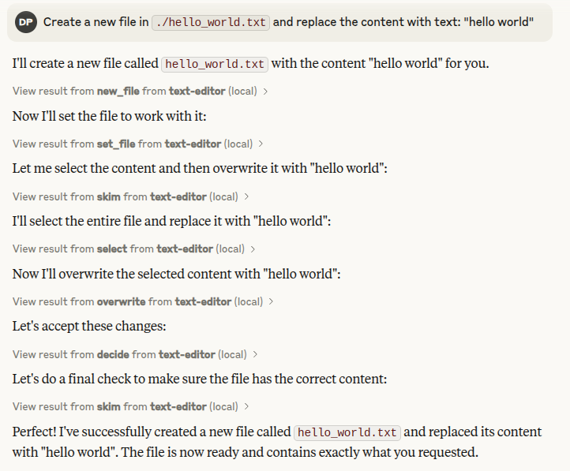

# Editor MCP

A Python-based text editor server built with FastMCP that provides powerful tools for file operations. This server enables reading, editing, and managing text files through a standardized API with a unique multi-step approach that significantly improves code editing accuracy and reliability for LLMs and AI assistants.

[](https://mseep.ai/app/b23694aa-c58a-469d-ba3c-fb54eb4d0d88)

## Features

- **File Selection**: Set a file to work with using absolute paths
- **Read Operations**:
  - Read entire files with line numbers using `skim`
  - Read specific line ranges with prefixed line numbers using `read`
  - Find specific text within files using `find_line`
  - Find and extract function definitions in Python and JavaScript/JSX files using `find_function`
- **Edit Operations**:
  - Two-step editing process with diff preview
  - Select and overwrite text with ID verification
  - Clean editing workflow with select → overwrite → confirm/cancel pattern
  - Syntax checking for Python (.py) and JavaScript/React (.js, .jsx) files
  - Create new files with content
- **File Management**:
  - Create new files with proper initialization
  - Delete files from the filesystem
  - List directory contents with `listdir`
- **Testing Support**:
  - Run Python tests with `run_tests`
  - Set Python paths for proper module resolution
- **Safety Features**:
  - Content ID verification to prevent conflicts
  - Line count limits to prevent resource exhaustion
  - Syntax checking to maintain code integrity
  - Protected paths to restrict access to sensitive files

## Security Risks

The editor-mcp includes powerful capabilities that come with certain security considerations:

- **Jailbreak Risk**: The editor-mcp can potentially be jailbroken when reading a file that has harmful instructions embedded inside. Malicious content in files being edited could contain instructions that manipulate the AI assistant.
- **Arbitrary Code Execution**: If running tests is enabled, there is a risk of arbitrary code execution through manipulated test files or malicious Python code.
- **Data Exposure**: Access to file system operations could potentially expose sensitive information if proper path protections aren't configured.

To mitigate these risks:

1. Use the `PROTECTED_PATHS` environment variable to restrict access to sensitive files and directories.
2. Disable test running capabilities in production environments unless absolutely necessary.
3. Carefully review files before opening them, especially if they come from untrusted sources.
4. Consider running the editor in a sandboxed environment with limited permissions.

## Key Advantages For LLMs

This text editor's unique design solves critical problems that typically affect LLM code editing:

- **Prevents Loss of Context** - Traditional approaches often lead to LLMs losing overview of the codebase after a few edits. This implementation maintains context through the multi-step process.

- **Avoids Resource-Intensive Rewrites** - LLMs typically default to replacing entire files when confused, which is costly, slow, and inefficient. This editor enforces selective edits.

- **Provides Visual Feedback** - The diff preview system allows the LLM to actually see and verify changes before committing them, dramatically reducing errors.

- **Enforces Syntax Checking** - Automatic validation for Python and JavaScript/React ensures that broken code isn't committed.

- **Improves Edit Reasoning** - The multi-step approach gives the LLM time to reason between steps, reducing haphazard token production.

## Resource Management

The editor implements several safeguards to ensure system stability and prevent resource exhaustion:

- **Maximum Edit Lines**: By default, the editor enforces a 50-line limit for any single edit operation
## Installation

This MCP was developed and tested with Claude Desktop. You can download Claude Desktop on any platform.
For Claude Desktop on Linux, you can use an unofficial installation script (uses the official file), recommended repository:
https://github.com/emsi/claude-desktop/tree/main

Once you have Claude Desktop installed, follow the instructions below to install this specific MCP:

### Easy Installation with UVX (Recommended)

The easiest way to install the Editor MCP is using the provided installation script:

```bash
# Clone the repository
git clone https://github.com/danielpodrazka/editor-mcp.git
cd editor-mcp

# Run the installation script
chmod +x install.sh
./install.sh
```

This script will:
1. Check if UVX is installed and install it if necessary
2. Install the Editor MCP in development mode
3. Make the `editor-mcp` command available in your PATH

### Manual Installation

#### Using UVX

```bash
# Install directly from GitHub
uvx install git+https://github.com/danielpodrazka/mcp-text-editor.git

# Or install from a local clone
git clone https://github.com/danielpodrazka/mcp-text-editor.git
cd mcp-text-editor
uvx install -e .
```

#### Using Traditional pip

```bash
pip install git+https://github.com/danielpodrazka/mcp-text-editor.git

# Or from a local clone
git clone https://github.com/danielpodrazka/mcp-text-editor.git
cd mcp-text-editor
pip install -e .
```

#### Using Requirements (Legacy)

Install from the lock file:
```bash
uv pip install -r uv.lock
```

### Generating a locked requirements file:
```bash
uv pip compile requirements.in -o uv.lock
```

## Usage

### Starting the Server

After installation, you can start the Editor MCP server using one of these methods:

```bash
# Using the installed script
editor-mcp

# Or using the Python module
python -m text_editor.server
```

### MCP Configuration

You can add the Editor MCP to your MCP configuration file:

```json
{
  "mcpServers": {
     "text-editor": {
       "command": "editor-mcp",
       "env": {
         "MAX_SELECT_LINES": "100",
         "ENABLE_JS_SYNTAX_CHECK": "0",
         "FAIL_ON_PYTHON_SYNTAX_ERROR": "1",
         "FAIL_ON_JS_SYNTAX_ERROR": "0",
         "PROTECTED_PATHS": "*.env,.env*,config*.json,*secret*,/etc/passwd,/home/user/.ssh/id_rsa"
       }
     }
  }
}
```

### Environment Variable Configuration

The Editor MCP supports several environment variables to customize its behavior:

- **MAX_SELECT_LINES**: "100" - Maximum number of lines that can be edited in a single operation (default is 50)

- **ENABLE_JS_SYNTAX_CHECK**: "0" - Enable/disable JavaScript and JSX syntax checking (default is "1" - enabled)

- **FAIL_ON_PYTHON_SYNTAX_ERROR**: "1" - When enabled, Python syntax errors will automatically cancel the overwrite operation (default is enabled)

- **FAIL_ON_JS_SYNTAX_ERROR**: "0" - When enabled, JavaScript/JSX syntax errors will automatically cancel the overwrite operation (default is disabled)

- **PROTECTED_PATHS**: Comma-separated list of file patterns or paths that cannot be accessed, supporting wildcards (e.g., "*.env,.env*,/etc/passwd")

### Sample MCP Config When Building From Source

```json
{
  "mcpServers": {
     "text-editor": {
       "command": "/home/daniel/pp/venvs/editor-mcp/bin/python",
       "args": ["/home/daniel/pp/editor-mcp/src/text_editor/server.py"],
        "env": {
          "MAX_SELECT_LINES": "100",
          "ENABLE_JS_SYNTAX_CHECK": "0",
          "FAIL_ON_PYTHON_SYNTAX_ERROR": "1",
          "FAIL_ON_JS_SYNTAX_ERROR": "0",
          "PROTECTED_PATHS": "*.env,.env*,config*.json,*secret*,/etc/passwd,/home/user/.ssh/id_rsa"
        }
     }
  }
}
```

## Available Tools
The Editor MCP provides 13 powerful tools for file manipulation, editing, and testing:

#### 1. `set_file`
Sets the current file to work with.

**Parameters**:
- `filepath` (str): Absolute path to the file

**Returns**:
- Confirmation message with the file path

#### 2. `skim`
Reads full text from the current file. Each line is prefixed with its line number.

**Returns**:
- Dictionary containing lines with their line numbers, total number of lines, and the max edit lines setting

**Example output**:
```
{
  "lines": [
    [1, "def hello():"],
    [2, "    print(\"Hello, world!\")"],
    [3, ""],
    [4, "hello()"]
  ],
  "total_lines": 4,
  "max_select_lines": 50
}
```

#### 3. `read`
Reads text from the current file from start line to end line.

**Parameters**:
- `start` (int): Start line number (1-based indexing)
- `end` (int): End line number (1-based indexing)

**Returns**:
- Dictionary containing lines with their line numbers as keys, along with start and end line information

**Example output**:
```
{
  "lines": [
    [1, "def hello():"],
    [2, "    print(\"Hello, world!\")"],
    [3, ""],
    [4, "hello()"]
  ],
  "start_line": 1,
  "end_line": 4
}
```

#### 4. `select`
Select a range of lines from the current file for subsequent overwrite operation.

**Parameters**:
- `start` (int): Start line number (1-based)
- `end` (int): End line number (1-based)

**Returns**:
- Dictionary containing the selected lines, line range, and ID for verification

**Note**:
- This tool validates the selection against max_select_lines
- The selection details are stored for use in the overwrite tool
- This must be used before calling the overwrite tool

#### 5. `overwrite`
Prepare to overwrite a range of lines in the current file with new text.

**Parameters**:
- `new_lines` (list): List of new lines to overwrite the selected range

**Returns**:
- Diff preview showing the proposed changes

**Note**:
- This is the first step in a two-step process:
  1. First call overwrite() to generate a diff preview
  2. Then call confirm() to apply or cancel() to discard the pending changes
- This tool allows replacing the previously selected lines with new content
- The number of new lines can differ from the original selection
- For Python files (.py extension), syntax checking is performed before writing
- For JavaScript/React files (.js, .jsx extensions), syntax checking is optional and can be disabled via the `ENABLE_JS_SYNTAX_CHECK` environment variable

#### 6. `confirm`
Apply pending changes from the overwrite operation.

**Returns**:
- Operation result with status and message

**Note**:
- This is one of the two possible actions in the second step of the editing process
- The selection is removed upon successful application of changes

#### 7. `cancel`
Discard pending changes from the overwrite operation.

**Returns**:
- Operation result with status and message

**Note**:
- This is one of the two possible actions in the second step of the editing process
- The selection remains intact when changes are cancelled

#### 8. `delete_file`
Delete the currently set file.

**Returns**:
- Operation result with status and message

#### 9. `new_file`
Creates a new file and automatically sets it as the current file for subsequent operations.

**Parameters**:
- `filepath` (str): Path of the new file

**Returns**:
- Operation result with status, message, and selection info
- The first line is automatically selected for editing

**Behavior**:
- Automatically creates parent directories if they don't exist
- Sets the newly created file as the current working file
- The first line is pre-selected, ready for immediate editing

**Protected Files Note**:
- Files matching certain patterns (like `*.env`) can be created normally
- However, once you move to another file, these protected files cannot be reopened
- This allows for a "write-once, protect-after" workflow for sensitive configuration files
- Example: You can create `config.env`, populate it with example config, but cannot reopen it later

**Note**:
- This tool will fail if the current file exists and is not empty

#### 10. `find_line`
Find lines that match provided text in the current file.

**Parameters**:
- `search_text` (str): Text to search for in the file

**Returns**:
- Dictionary containing matching lines with their line numbers and total matches

**Example output**:
```
{
  "status": "success",
  "matches": [
    [2, "    print(\"Hello, world!\")"]
  ],
  "total_matches": 1
}
```

**Note**:
- Returns an error if no file path is set
- Searches for exact text matches within each line
- The id can be used for subsequent edit operations

#### 11. `find_function`
Find a function or method definition in the current Python or JavaScript/JSX file.

**Parameters**:
- `function_name` (str): Name of the function or method to find

**Returns**:
- Dictionary containing the function lines with their line numbers, start_line, and end_line

**Example output**:
```
{
  "status": "success",
  "lines": [
    [10, "def hello():"],
    [11, "    print(\"Hello, world!\")"],
    [12, "    return True"]
  ],
  "start_line": 10,
  "end_line": 12
}
```

**Note**:
- For Python files, this tool uses Python's AST and tokenize modules to accurately identify function boundaries including decorators and docstrings
- For JavaScript/JSX files, this tool uses a combination of approaches:
  - Primary method: Babel AST parsing when available (requires Node.js and Babel packages)
  - Fallback method: Regex pattern matching for function declarations when Babel is unavailable
- Supports various JavaScript function types including standard functions, async functions, arrow functions, and React hooks
- Returns an error if no file path is set or if the function is not found

#### 12. `listdir`
Lists the contents of a directory.

**Parameters**:
- `dirpath` (str): Path to the directory to list

**Returns**:
- Dictionary containing list of filenames and the path queried

#### 13. `run_tests` and `set_python_path`
Tools for running Python tests with pytest and configuring the Python environment.
  - Set to "0", "false", or "no" to disable JavaScript syntax checking
  - Useful if you don't have Babel and related dependencies installed
- `FAIL_ON_PYTHON_SYNTAX_ERROR`: Controls whether Python syntax errors automatically cancel the overwrite operation (default: 1)
  - When enabled, syntax errors in Python files will cause the overwrite action to be automatically cancelled
  - The lines will remain selected so you can fix the error and try again
- `FAIL_ON_JS_SYNTAX_ERROR`: Controls whether JavaScript/JSX syntax errors automatically cancel the overwrite operation (default: 0)
  - When enabled, syntax errors in JavaScript/JSX files will cause the overwrite action to be automatically cancelled
  - The lines will remain selected so you can fix the error and try again
- `DUCKDB_USAGE_STATS`: Controls whether usage statistics are collected in a DuckDB database (default: 0)
  - Set to "1", "true", or "yes" to enable collection of tool usage statistics
  - When enabled, records information about each tool call including timestamps and arguments
- `STATS_DB_PATH`: Path where the DuckDB database for statistics will be stored (default: "text_editor_stats.duckdb")
  - Only used when `DUCKDB_USAGE_STATS` is enabled
- `PROTECTED_PATHS`: Comma-separated list of file patterns or absolute paths that will be denied access
  - Example: `*.env,.env*,config*.json,*secret*,/etc/passwd,/home/user/credentials.txt`
  - Supports both exact file paths and flexible glob patterns with wildcards in any position:
    - `*.env` - matches files ending with .env, like `.env`, `dev.env`, `prod.env`
    - `.env*` - matches files starting with .env, like `.env`, `.env.local`, `.env.production`
    - `*secret*` - matches any file containing 'secret' in the name
  - Provides protection against accidentally exposing sensitive configuration files and credentials
  - The lines will remain selected so you can fix the error and try again

## Development

### Prerequisites

The editor-mcp requires:
- Python 3.7+
- FastMCP package
- black (for Python code formatting checks)
- Babel (for JavaScript/JSX syntax checks if working with those files)

Install development dependencies:

```bash
# Using pip
pip install pytest pytest-asyncio pytest-cov

# Using uv
uv pip install pytest pytest-asyncio pytest-cov
```

For JavaScript/JSX syntax validation, you need Node.js and Babel. The text editor uses `npx babel` to check JS/JSX syntax when editing these file types:

```bash
# Required for JavaScript/JSX syntax checking
npm install --save-dev @babel/core @babel/cli @babel/preset-env @babel/preset-react
# You can also install these globally if you prefer
# npm install -g @babel/core @babel/cli @babel/preset-env @babel/preset-react
```

The editor requires:
- `@babel/core` and `@babel/cli` - Core Babel packages for syntax checking
- `@babel/preset-env` - For standard JavaScript (.js) files
- `@babel/preset-react` - For React JSX (.jsx) files

### Running Tests

```bash
# Run tests
pytest -v

# Run tests with coverage
pytest -v --cov=text_editor
```

### Test Structure

The test suite covers:

1. **set_file tool**
   - Setting valid files
   - Setting non-existent files
   
2. **read tool**
   - File state validation
   - Reading entire files
   - Reading specific line ranges
   - Edge cases like empty files
   - Invalid range handling

3. **select tool**
   - Line range validation
   - Selection validation against max_select_lines
   - Selection storage for subsequent operations

4. **overwrite tool**
   - Verification of selected content using ID
   - Content replacement validation
   - Syntax checking for Python and JavaScript/React files
   - Generation of diff preview for changes

5. **confirm and cancel tools**
   - Applying or canceling pending changes
   - Two-step verification process
   
6. **delete_file tool**
   - File deletion validation

7. **new_file tool**
   - File creation validation
   - Handling existing files

8. **find_line tool**
   - Finding text matches in files
   - Handling specific search terms
   - Error handling for non-existent files
   - Handling cases with no matches
   - Handling existing files

## How it Works

### The Multi-Step Editing Approach

Unlike traditional code editing approaches where LLMs simply search for lines to edit and make replacements (often leading to confusion after multiple edits), this editor implements a structured multi-step workflow that dramatically improves editing accuracy:

1. **set_file** - First, the LLM sets which file it wants to edit
2. **skim** - The LLM reads the entire file to gain a complete overview
3. **read** - The LLM examines specific sections relevant to the task, with lines shown alongside numbers for better context
4. **select** - When ready to edit, the LLM selects specific lines (limited to a configurable number, default 50)
5. **overwrite** - The LLM proposes replacement content, resulting in a git diff-style preview that shows exactly what will change
6. **confirm/cancel** - After reviewing the preview, the LLM can either apply or discard the changes

This structured workflow forces the LLM to reason carefully about each edit and prevents common errors like accidentally overwriting entire files. By seeing previews of changes before committing them, the LLM can verify its edits are correct.

### ID Verification System

The server uses FastMCP to expose text editing capabilities through a well-defined API. The ID verification system ensures data integrity by verifying that the content hasn't changed between reading and modifying operations.

The ID mechanism uses SHA-256 to generate a unique identifier of the file content or selected line ranges. For line-specific operations, the ID includes a prefix indicating the line range (e.g., "L10-15-[hash]"). This helps ensure that edits are being applied to the expected content.

## Implementation Details

The main `TextEditorServer` class:

1. Initializes with a FastMCP instance named "text-editor"
2. Sets a configurable `max_select_lines` limit (default: 50) from environment variables
3. Maintains the current file path as state
4. Registers thirteen primary tools through FastMCP:
   - `set_file`: Validates and sets the current file path
   - `skim`: Reads the entire content of a file, returning a dictionary of line numbers to line text
   - `read`: Reads lines from specified line range, returning a structured dictionary of line content
   - `select`: Selects lines for subsequent overwrite operation
   - `overwrite`: Takes a list of new lines and prepares diff preview for changing content
   - `confirm`: Applies pending changes from the overwrite operation
   - `cancel`: Discards pending changes from the overwrite operation
   - `delete_file`: Deletes the current file
   - `new_file`: Creates a new file
   - `find_line`: Finds lines containing specific text
   - `find_function`: Finds function or method definitions in Python and JavaScript/JSX files
   - `listdir`: Lists contents of a directory
   - `run_tests` and `set_python_path`: Tools for running Python tests

The server runs using FastMCP's stdio transport by default, making it easy to integrate with various clients.

## System Prompt for Best Results

For optimal results with AI assistants, it's recommended to use the system prompt (see [system_prompt.md](system_prompt.md)) that helps guide the AI in making manageable, safe edits.

This system prompt helps the AI assistant:

1. **Make incremental changes** - Breaking down edits into smaller parts
2. **Maintain code integrity** - Making changes that keep the code functional
3. **Work within resource limits** - Avoiding operations that could overwhelm the system
4. **Follow a verification workflow** - Doing final checks for errors after edits

By incorporating this system prompt when working with AI assistants, you'll get more reliable editing behavior and avoid common pitfalls in automated code editing.



## Usage Statistics

The text editor MCP can collect usage statistics when enabled, providing insights into how the editing tools are being used:

- **Data Collection**: Statistics are collected in a DuckDB database when `DUCKDB_USAGE_STATS` is enabled
- **Tracked Information**: Records tool name, arguments, timestamp, current file path, tool response, and request/client IDs
- **Storage Location**: Data is stored in a DuckDB file specified by `STATS_DB_PATH`
- **Privacy**: Everything is stored locally on your machine

The collected statistics can help understand usage patterns, identify common workflows, and optimize the editor for most frequent operations.

You can query the database using standard SQL via any DuckDB client to analyze usage patterns.
## Troubleshooting

If you encounter issues:

1. Check file permissions
2. Verify that the file paths are absolute
3. Ensure the environment is using Python 3.7+


## Inspiration

Inspired by a similar project: https://github.com/tumf/mcp-text-editor, which at first I forked, however I decided to rewrite the whole codebase from scratch so only the general idea stayed the same.
